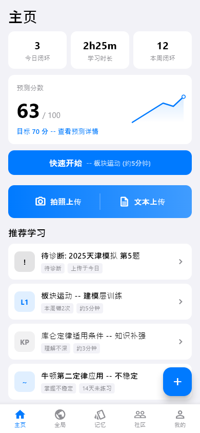
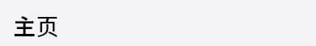
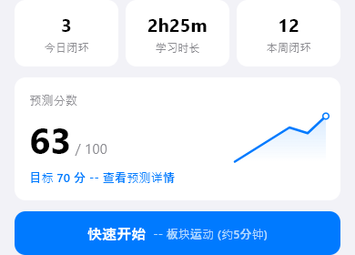
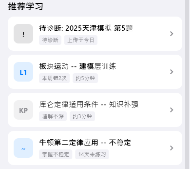

# home（首页）

## 当前状态

第二阶段完成，所有组件已实现，视觉效果已对齐 HTML 原型。

## 路由标识

`/`

## 组件树

```
HomePage (PageShell, tabIndex: 0)
├── TopFrameWidget — 页面标题
├── TopDashboardWidget — 核心指标仪表盘
├── UploadErrorCardWidget — 上传错题入口卡片
├── RecommendationListWidget — 推荐学习列表
├── RecentUploadWidget — 最近上传记录
└── FloatingActionButton — 右下角上传按钮 → /upload-menu
```

## 页面截图



---

## 组件详情

### top-frame



- 功能说明: 显示页面标题「主页」
- 预期用途: 导航标题展示，无数据接入需求
- 对应 dart 文件: `lib/features/home/widgets/top_frame_widget.dart`
- 视觉状态: 已对齐 HTML 原型

### top-dashboard



- 功能说明: 展示三个核心学习指标卡片
- 预期用途: 接入用户学习统计 API，展示「预测分数」「本周闭环数」「待诊断题数」三个核心指标。预测分数点击后跳转预测中心，待诊断数点击后跳转上传历史，作为用户每日打开 App 的第一信息入口。当前为 mock 数据，后续需替换为 API 返回值
- 对应 dart 文件: `lib/features/home/widgets/top_dashboard_widget.dart`
- 视觉状态: 已对齐 HTML 原型

### action-overlay（UploadErrorCardWidget）


- 功能说明: 上传错题的入口卡片，引导用户拍照上传
- 预期用途: 接入上传服务 API，展示「拍照上传错题」入口。点击后跳转上传菜单页（/upload-menu），开始错题上传流程。当前为静态展示，后续需接入上传状态和最近上传提示
- 对应 dart 文件: `lib/features/home/widgets/action_overlay_widget.dart`
- 视觉状态: 已对齐 HTML 原型

### recommendation-list



- 功能说明: 展示 AI 推荐的学习内容列表
- 预期用途: 接入 AI 推荐引擎 API，按优先级展示推荐学习项（知识点学习、模型训练等）。每项显示类型标签、标题、推荐理由。点击后跳转对应的知识点学习或模型训练页面，形成「推荐→执行」闭环。当前为 mock 数据，后续需替换为 API 返回值
- 对应 dart 文件: `lib/features/home/widgets/recommendation_list_widget.dart`
- 视觉状态: 已对齐 HTML 原型

### recent-upload


- 功能说明: 展示最近的上传记录摘要
- 预期用途: 接入上传记录 API，展示最近 2-3 条上传记录的类型、时间和诊断状态。点击可跳转上传历史页（/upload-history）查看完整记录。当前为 mock 数据，后续需替换为 API 返回值
- 对应 dart 文件: `lib/features/home/widgets/recent_upload_widget.dart`
- 视觉状态: 已对齐 HTML 原型

## 页面跳转

- FloatingActionButton → `/upload-menu`（上传菜单）
- TopDashboardWidget 预测分数 → `/prediction-center`（预测中心）
- TopDashboardWidget 待诊断 → `/upload-history`（上传历史）
- RecommendationListWidget 各项 → 对应的知识点学习/模型训练页面
