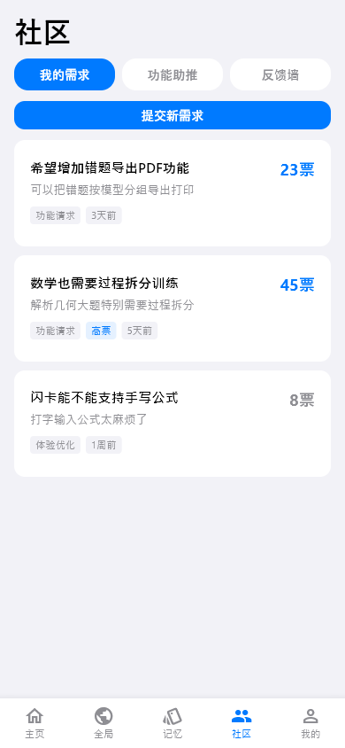
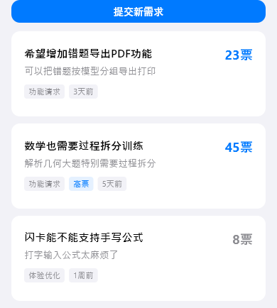

# community（社区）

## 当前状态

第二阶段完成，所有组件已实现，视觉效果已对齐 HTML 原型。

## 路由标识

`/community`

## 组件树

```
CommunityPage (PageShell, tabIndex: 3)
├── TopFrameAndTabsWidget — 标题 + 三个 Tab（我的需求/功能助推/反馈）
└── [Tab 内容，按 activeTab 切换]
    ├── BoardMyRequestsWidget — 我的需求列表（tab 0）
    ├── BoardFeatureBoostWidget — 功能助推列表（tab 1）
    └── BoardFeedbackWidget — 反馈列表（tab 2）
```

## 页面截图



---

## 组件详情

### top-frame-and-tabs


- 功能说明: 页面标题「社区」+ 三个切换 Tab
- 预期用途: 提供「我的需求 / 功能助推 / 反馈」三个板块的 Tab 切换导航。Tab 切换时联动下方内容区域，无需数据接入
- 对应 dart 文件: `lib/features/community/widgets/top_frame_and_tabs_widget.dart`
- 视觉状态: 已对齐 HTML 原型

### board-my-requests



- 功能说明: 展示用户提交的需求列表
- 预期用途: 接入社区需求 API，展示用户提交的功能需求列表，每条显示标题、描述、投票数和状态。用户可点击查看详情（跳转 /community-detail），也可提交新需求。当前为 mock 数据
- 对应 dart 文件: `lib/features/community/widgets/board_my_requests_widget.dart`
- 视觉状态: 已对齐 HTML 原型

### board-feature-boost

- 功能说明: 展示可投票助推的功能列表
- 预期用途: 接入社区功能助推 API，展示待开发功能列表，用户可投票助推优先级。每条显示功能名称、描述、当前票数。当前为 mock 数据
- 对应 dart 文件: `lib/features/community/widgets/board_feature_boost_widget.dart`
- 视觉状态: 已对齐 HTML 原型
- 截图说明: 默认 Tab 为「我的需求」，此组件需切换到 Tab 1 才可见，当前截图未采集

### board-feedback

- 功能说明: 展示用户反馈列表
- 预期用途: 接入社区反馈 API，展示用户提交的 bug 反馈和改进建议。每条显示标题、类型标签、状态。当前为 mock 数据
- 对应 dart 文件: `lib/features/community/widgets/board_feedback_widget.dart`
- 视觉状态: 已对齐 HTML 原型
- 截图说明: 需切换到 Tab 2 才可见，当前截图未采集

## 页面跳转

- 需求列表项点击 → `/community-detail`（社区详情）
