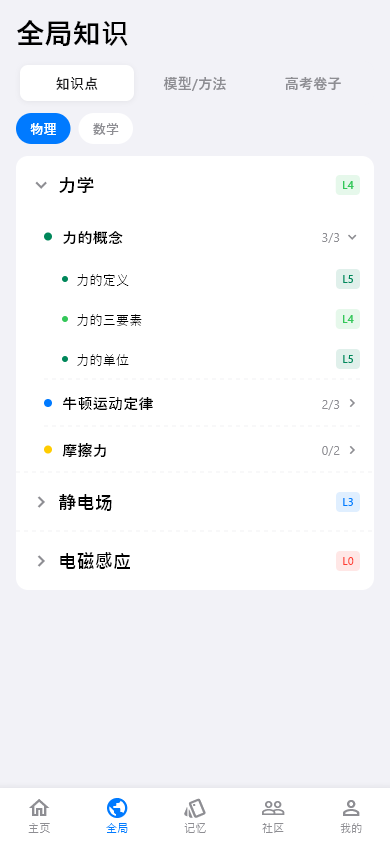
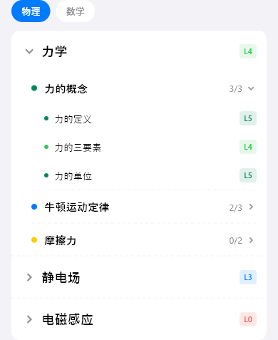

# global-knowledge（全局知识点）

## 当前状态

第二阶段完成，所有组件已实现，视觉效果已对齐 HTML 原型。

## 路由标识

`/global-knowledge`

## 组件树

```
GlobalKnowledgePage (PageShell, tabIndex: 1)
├── TopFrameWidget — 页面标题 + 分段控制器
└── KnowledgeTreeWidget — 知识点树形列表
```

## 页面截图



---

## 组件详情

### top-frame


- 功能说明: 页面标题「全局知识点」+ 分段控制器（按科目切换）
- 预期用途: 导航标题 + 科目筛选，切换时联动下方知识点树。无独立数据接入需求
- 对应 dart 文件: `lib/features/global_knowledge/widgets/top_frame_widget.dart`
- 视觉状态: 已对齐 HTML 原型

### knowledge-tree



- 功能说明: 以树形结构展示所有知识点及其掌握等级
- 预期用途: 接入知识点列表 API，按章节层级展示知识点树。每个节点显示知识点名称和掌握等级（L0-L5，颜色编码）。点击知识点跳转知识点详情页（/knowledge-detail），查看详细掌握情况。当前为 mock 数据
- 对应 dart 文件: `lib/features/global_knowledge/widgets/knowledge_tree_widget.dart`
- 视觉状态: 已对齐 HTML 原型

## 页面跳转

- 知识点节点点击 → `/knowledge-detail`（知识点详情）
