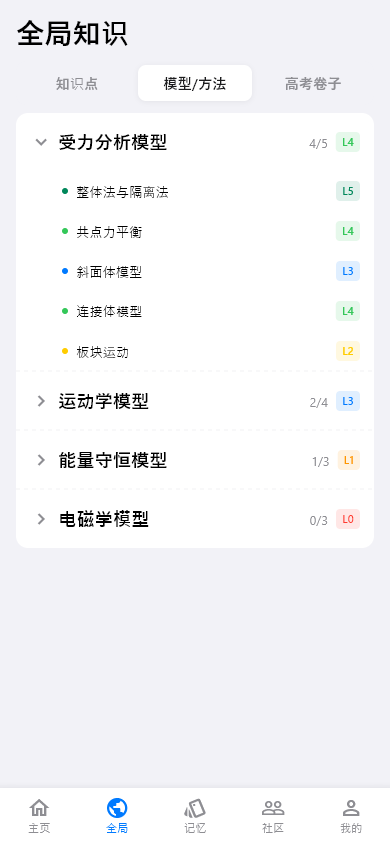
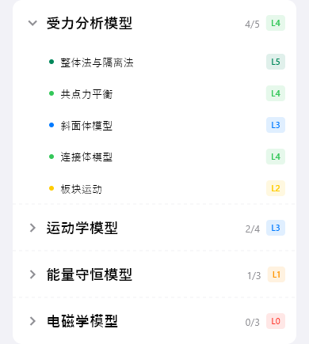

# global-model（全局模型）

## 当前状态

第二阶段完成，所有组件已实现，视觉效果已对齐 HTML 原型。

## 路由标识

`/global-model`

## 组件树

```
GlobalModelPage (Scaffold)
├── TopFrameWidget — 页面标题 + 返回按钮
└── ModelTreeWidget — 模型树形列表
```

## 页面截图



---

## 组件详情

### top-frame


- 功能说明: 页面标题「全局模型」+ 返回导航
- 预期用途: 导航返回 + 页面标题展示，无数据接入需求
- 对应 dart 文件: `lib/features/global_model/widgets/top_frame_widget.dart`
- 视觉状态: 已对齐 HTML 原型

### model-tree



- 功能说明: 以树形结构展示所有解题模型及其掌握等级
- 预期用途: 接入模型列表 API，按分类层级展示模型树。每个节点显示模型名称和掌握等级（L0-L5，颜色编码）。点击模型跳转模型详情页（/model-detail），查看详细训练情况。当前为 mock 数据
- 对应 dart 文件: `lib/features/global_model/widgets/model_tree_widget.dart`
- 视觉状态: 已对齐 HTML 原型

## 页面跳转

- 模型节点点击 → `/model-detail`（模型详情）
- 返回按钮 → 返回上一页
