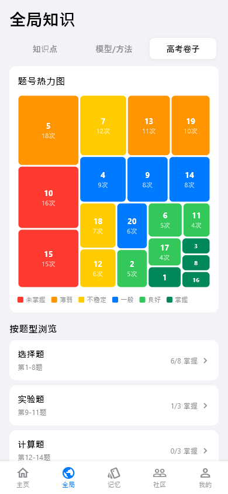
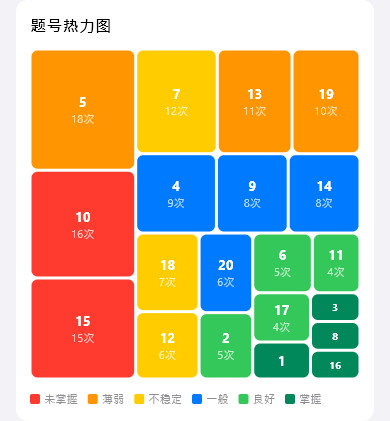

# global-exam（全局高考卷）

## 当前状态

第二阶段完成，所有组件已实现，视觉效果已对齐 HTML 原型。

## 路由标识

`/global-exam`

## 组件树

```
GlobalExamPage (Scaffold)
├── TopFrameWidget — 页面标题 + Tab 切换
├── ExamHeatmapWidget — 考试热力图矩阵
├── QuestionTypeBrowserWidget — 题型浏览器
└── RecentExamsWidget — 最近考试列表
```

## 页面截图



---

## 组件详情

### top-frame


- 功能说明: 页面标题「全局高考卷」+ 返回导航
- 预期用途: 导航返回 + 页面标题展示，无数据接入需求
- 对应 dart 文件: `lib/features/global_exam/widgets/top_frame_widget.dart`
- 视觉状态: 已对齐 HTML 原型

### exam-heatmap



- 功能说明: 以热力图矩阵展示历次考试的逐题得分分布
- 预期用途: 接入用户历次考试的逐题得分数据，以热力图矩阵展示每道题的对错分布。横轴为题号，纵轴为考试场次，颜色深浅表示得分率，帮助用户一眼识别薄弱题型集中区域。当前为 mock 数据
- 对应 dart 文件: `lib/features/global_exam/widgets/exam_heatmap_widget.dart`
- 视觉状态: 已对齐 HTML 原型

### question-type-browser


- 功能说明: 按题型分类浏览考试题目
- 预期用途: 接入题型分类 API，按选择题/填空题/大题等分类展示题目统计。点击题型可筛选查看对应题目列表。当前为 mock 数据
- 对应 dart 文件: `lib/features/global_exam/widgets/question_type_browser_widget.dart`
- 视觉状态: 已对齐 HTML 原型

### recent-exams


- 功能说明: 展示最近的考试记录列表
- 预期用途: 接入考试记录 API，按时间倒序展示最近考试，每条显示考试名称、日期、总分。点击可查看该场考试的详细分析。当前为 mock 数据
- 对应 dart 文件: `lib/features/global_exam/widgets/recent_exams_widget.dart`
- 视觉状态: 已对齐 HTML 原型

## 页面跳转

- 返回按钮 → 返回上一页
