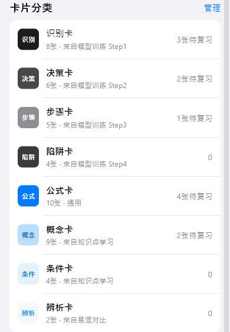

# memory（记忆）

## 当前状态

第二阶段完成，所有组件已实现，视觉效果已对齐 HTML 原型。

## 路由标识

`/memory`

## 组件树

```
MemoryPage (PageShell, tabIndex: 2)
├── TopFrameWidget — 页面标题
├── ReviewDashboardWidget — 复习仪表盘
└── CardCategoryListWidget — 卡片分类列表
```

## 页面截图


---

## 组件详情

### top-frame


- 功能说明: 页面标题「记忆」
- 预期用途: 导航标题展示，无数据接入需求
- 对应 dart 文件: `lib/features/memory/widgets/top_frame_widget.dart`
- 视觉状态: 已对齐 HTML 原型

### review-dashboard


- 功能说明: 展示今日复习统计和复习进度
- 预期用途: 接入间隔重复算法 API，展示「今日待复习」「已复习」「复习正确率」等统计。底部显示「开始复习」按钮，点击跳转闪卡复习页（/flashcard-review）。当前为 mock 数据
- 对应 dart 文件: `lib/features/memory/widgets/review_dashboard_widget.dart`
- 视觉状态: 已对齐 HTML 原型

### card-category-list



- 功能说明: 按分类展示闪卡集合
- 预期用途: 接入闪卡分类 API，按知识点/模型分类展示闪卡集合。每个分类显示卡片数量、待复习数。点击分类可进入该分类的闪卡复习。当前为 mock 数据
- 对应 dart 文件: `lib/features/memory/widgets/card_category_list_widget.dart`
- 视觉状态: 已对齐 HTML 原型

## 页面跳转

- 开始复习按钮 → `/flashcard-review`（闪卡复习）
