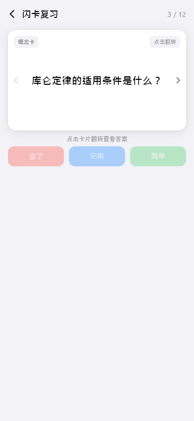
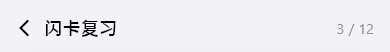
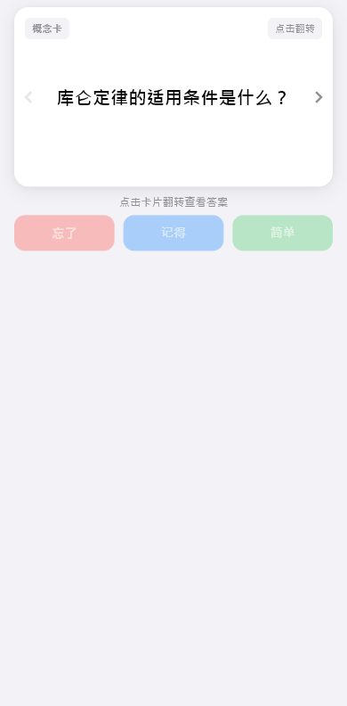

# flashcard-review（闪卡复习）

## 当前状态

第二阶段完成，所有组件已实现，视觉效果已对齐 HTML 原型。

## 路由标识

`/flashcard-review`

## 组件树

```
FlashcardReviewPage (Scaffold)
├── TopFrameWidget — 页面标题 + 返回 + 进度
└── FlashcardWidget — 闪卡主体（16:9 翻转卡片 + 反馈按钮）
```

## 页面截图



---

## 组件详情

### top-frame



- 功能说明: 返回按钮 + 标题「闪卡复习」+ 进度指示
- 预期用途: 导航返回 + 显示当前复习进度（如 3/12），无独立数据接入需求
- 对应 dart 文件: `lib/features/flashcard_review/widgets/top_frame_widget.dart`
- 视觉状态: 已对齐 HTML 原型

### flashcard



- 功能说明: 16:9 比例的翻转闪卡，正面显示问题，反面显示答案，底部有反馈按钮
- 预期用途: 接入间隔重复算法 API，展示待复习的闪卡内容。用户点击卡片翻转查看答案，然后通过底部按钮（记住/模糊/忘记）反馈掌握程度，系统据此调整下次复习时间。当前为 mock 数据
- 对应 dart 文件: `lib/features/flashcard_review/widgets/flashcard_widget.dart`
- 视觉状态: 已对齐 HTML 原型

## 页面跳转

- 返回按钮 → 返回上一页（/memory）
