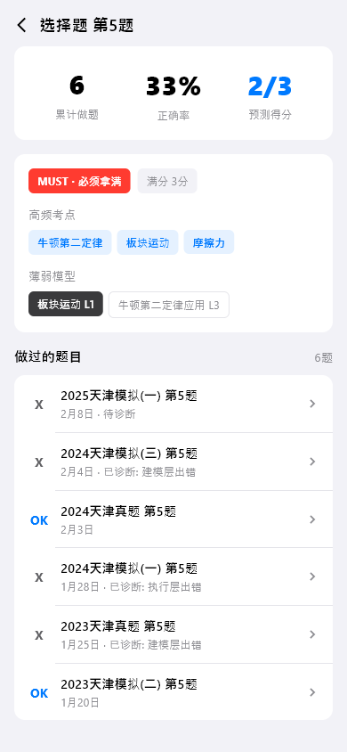
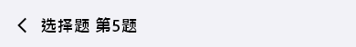
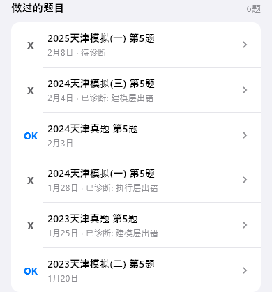

# question-aggregate（单题聚合）

## 当前状态

第二阶段完成，所有组件已实现，视觉效果已对齐 HTML 原型。

## 路由标识

`/question-aggregate`

## 组件树

```
QuestionAggregatePage (Scaffold)
├── TopFrameWidget — 页面标题 + 返回
├── SingleQuestionDashboardWidget — 单题统计仪表盘
├── ExamAnalysisWidget — 考试分析
└── QuestionHistoryListWidget — 题目历史记录列表
```

## 页面截图



---

## 组件详情

### top-frame



- 功能说明: 返回按钮 + 标题「单题聚合」
- 预期用途: 导航返回 + 页面标题展示，无数据接入需求
- 对应 dart 文件: `lib/features/question_aggregate/widgets/top_frame_widget.dart`
- 视觉状态: 已对齐 HTML 原型

### single-question-dashboard


- 功能说明: 展示单道题目的综合统计指标
- 预期用途: 接入题目统计 API，展示该题的出现次数、正确率、平均耗时等核心指标。帮助用户了解单题的整体掌握趋势。当前为 mock 数据
- 对应 dart 文件: `lib/features/question_aggregate/widgets/single_question_dashboard_widget.dart`
- 视觉状态: 已对齐 HTML 原型

### exam-analysis


- 功能说明: 展示该题在不同考试中的表现分析
- 预期用途: 接入考试维度的题目分析数据，展示该题在每次考试中的得分情况和错误类型。帮助用户识别是否存在稳定性问题。当前为 mock 数据
- 对应 dart 文件: `lib/features/question_aggregate/widgets/exam_analysis_widget.dart`
- 视觉状态: 已对齐 HTML 原型

### question-history-list



- 功能说明: 按时间倒序展示该题的历次作答记录
- 预期用途: 接入题目作答历史 API，展示每次作答的日期、得分、用时。点击可跳转题目详情页查看具体作答内容。当前为 mock 数据
- 对应 dart 文件: `lib/features/question_aggregate/widgets/question_history_list_widget.dart`
- 视觉状态: 已对齐 HTML 原型

## 页面跳转

- 返回按钮 → 返回上一页
- 历史记录项点击 → `/question-detail`（题目详情）
