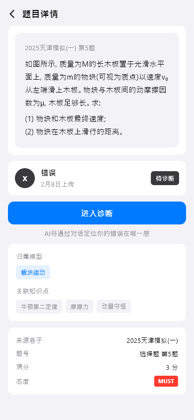
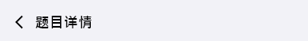
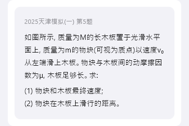
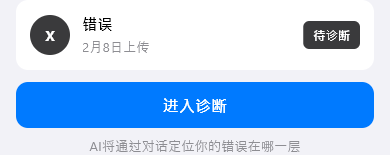
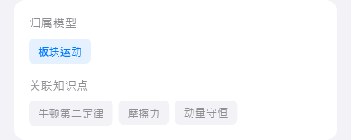
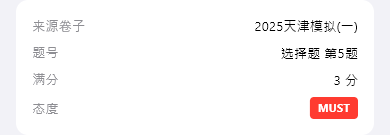

# question-detail（题目详情）

## 当前状态

第二阶段完成，所有组件已实现，视觉效果已对齐 HTML 原型。

## 路由标识

`/question-detail`

## 组件树

```
QuestionDetailPage (Scaffold)
├── TopFrameWidget — 页面标题 + 返回
├── QuestionContentWidget — 题目内容展示
├── AnswerResultWidget — 作答结果
├── QuestionRelationsWidget — 关联知识点/模型
└── QuestionSourceWidget — 题目来源信息
```

## 页面截图



---

## 组件详情

### top-frame



- 功能说明: 返回按钮 + 标题「题目详情」
- 预期用途: 导航返回 + 页面标题展示，无数据接入需求
- 对应 dart 文件: `lib/features/question_detail/widgets/top_frame_widget.dart`
- 视觉状态: 已对齐 HTML 原型

### question-content



- 功能说明: 展示题目的完整内容（题干、选项等）
- 预期用途: 接入题目内容 API，展示题目原文、选项（如有）、图片（如有）。支持数学公式渲染。当前为 mock 数据
- 对应 dart 文件: `lib/features/question_detail/widgets/question_content_widget.dart`
- 视觉状态: 已对齐 HTML 原型

### answer-result



- 功能说明: 展示用户作答结果和正确答案对比
- 预期用途: 接入作答记录 API，展示用户答案、正确答案、得分、AI 解析。用颜色区分对错（绿色正确/红色错误）。当前为 mock 数据
- 对应 dart 文件: `lib/features/question_detail/widgets/answer_result_widget.dart`
- 视觉状态: 已对齐 HTML 原型

### question-relations



- 功能说明: 展示该题关联的知识点和解题模型
- 预期用途: 接入题目关联 API，展示该题涉及的知识点（可点击跳转知识点详情）和解题模型（可点击跳转模型详情）。帮助用户理解题目的知识结构。当前为 mock 数据
- 对应 dart 文件: `lib/features/question_detail/widgets/question_relations_widget.dart`
- 视觉状态: 已对齐 HTML 原型

### question-source



- 功能说明: 展示题目的来源信息
- 预期用途: 接入题目元数据 API，展示题目来源（哪次考试/作业）、上传时间、题号等信息。当前为 mock 数据
- 对应 dart 文件: `lib/features/question_detail/widgets/question_source_widget.dart`
- 视觉状态: 已对齐 HTML 原型

## 页面跳转

- 返回按钮 → 返回上一页
- 关联知识点点击 → `/knowledge-detail`
- 关联模型点击 → `/model-detail`
