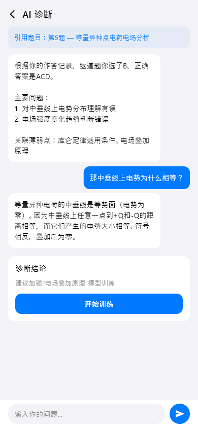
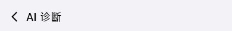

# ai-diagnosis（AI诊断）

## 当前状态

第二阶段完成，所有组件已实现，视觉效果已对齐 HTML 原型。

## 路由标识

`/ai-diagnosis`

## 组件树

```
AiDiagnosisPage (Scaffold)
├── TopFrameWidget — 页面标题 + 返回
├── MainContentWidget — 诊断对话主体
└── ActionOverlayWidget — 底部操作浮层
```

## 页面截图



---

## 组件详情

### top-frame



- 功能说明: 返回按钮 + 标题「AI诊断」
- 预期用途: 导航返回 + 页面标题展示，无数据接入需求
- 对应 dart 文件: `lib/features/ai_diagnosis/widgets/top_frame_widget.dart`
- 视觉状态: 已对齐 HTML 原型

### main-content


- 功能说明: AI 诊断对话界面，展示诊断过程和结果
- 预期用途: 接入 AI 诊断引擎 API，以对话形式展示 AI 对错题的诊断过程。包括错误原因分析、知识点定位、模型匹配等步骤。诊断完成后生成结论，关联到对应的知识点和模型。当前为 mock 对话数据
- 对应 dart 文件: `lib/features/ai_diagnosis/widgets/main_content_widget.dart`
- 视觉状态: 已对齐 HTML 原型

### action-overlay


- 功能说明: 底部操作浮层，提供诊断相关操作按钮
- 预期用途: 提供「开始诊断」「重新诊断」「查看结果」等操作入口。诊断完成后可跳转到关联的知识点学习或模型训练页面
- 对应 dart 文件: `lib/features/ai_diagnosis/widgets/action_overlay_widget.dart`
- 视觉状态: 已对齐 HTML 原型

## 页面跳转

- 返回按钮 → 返回上一页
- 诊断结果中的知识点 → `/knowledge-detail`
- 诊断结果中的模型 → `/model-detail`
