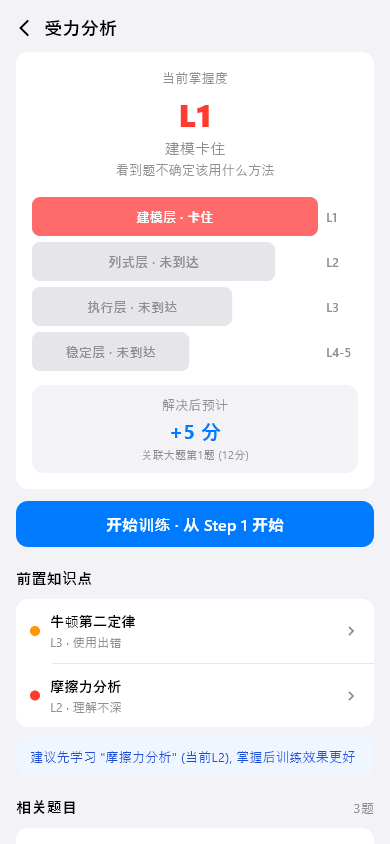
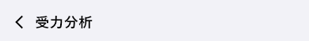
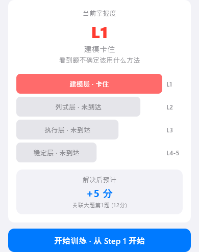
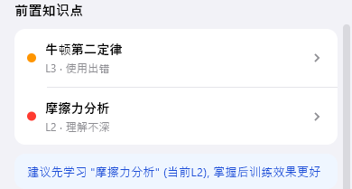
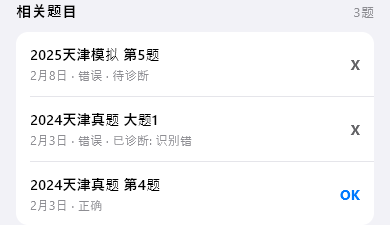
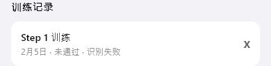

# model-detail（模型详情）

## 当前状态

第二阶段完成，所有组件已实现，视觉效果已对齐 HTML 原型。

## 路由标识

`/model-detail`

## 组件树

```
ModelDetailPage (Scaffold)
├── TopFrameWidget — 页面标题 + 返回
├── MasteryDashboardWidget — 掌握度四层漏斗
├── PrerequisiteKnowledgeListWidget — 前置知识点列表
├── RelatedQuestionListWidget — 关联题目列表
└── TrainingRecordListWidget — 训练记录列表
```

## 页面截图



---

## 组件详情

### top-frame



- 功能说明: 返回按钮 + 标题（模型名称）
- 预期用途: 导航返回 + 显示当前模型名称，无独立数据接入需求
- 对应 dart 文件: `lib/features/model_detail/widgets/top_frame_widget.dart`
- 视觉状态: 已对齐 HTML 原型

### mastery-dashboard



- 功能说明: 以四层漏斗展示模型掌握度
- 预期用途: 接入单个模型的掌握度评估数据，以四层漏斗（建模层/列式层/执行层/稳定层）展示当前卡在哪一层。底部显示关联大题的预计提分，点击「开始训练」进入模型训练页的对应 Step，形成「诊断→定位→训练」闭环。当前为 mock 数据
- 对应 dart 文件: `lib/features/model_detail/widgets/mastery_dashboard_widget.dart`
- 视觉状态: 已对齐 HTML 原型

### prerequisite-knowledge-list



- 功能说明: 展示该模型的前置知识点及掌握状态
- 预期用途: 接入模型依赖关系 API，展示训练该模型前需要掌握的知识点列表，每项显示知识点名称和掌握状态（X/OK）。未掌握的知识点可点击跳转学习。当前为 mock 数据
- 对应 dart 文件: `lib/features/model_detail/widgets/prerequisite_knowledge_list_widget.dart`
- 视觉状态: 已对齐 HTML 原型

### related-question-list



- 功能说明: 展示与该模型关联的题目列表
- 预期用途: 接入模型-题目关联 API，展示使用该模型的历史题目。点击可跳转题目详情页。当前为 mock 数据
- 对应 dart 文件: `lib/features/model_detail/widgets/related_question_list_widget.dart`
- 视觉状态: 已对齐 HTML 原型

### training-record-list



- 功能说明: 展示该模型的历次训练记录
- 预期用途: 接入训练记录 API，按时间倒序展示每次训练的日期、完成步骤、结果。当前为 mock 数据
- 对应 dart 文件: `lib/features/model_detail/widgets/training_record_list_widget.dart`
- 视觉状态: 已对齐 HTML 原型

## 页面跳转

- 返回按钮 → 返回上一页
- 开始训练 → `/model-training`
- 前置知识点点击 → `/knowledge-detail`
- 关联题目点击 → `/question-detail`
