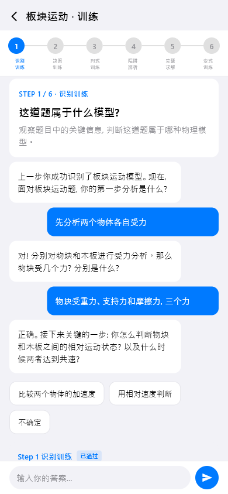
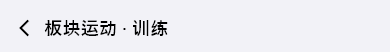
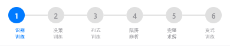
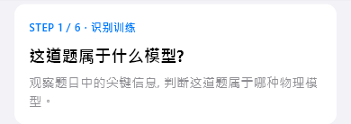

# model-training（模型训练）

## 当前状态

第二阶段完成，所有组件已实现，视觉效果已对齐 HTML 原型。

## 路由标识

`/model-training`

## 组件树

```
ModelTrainingPage (Scaffold)
├── TopFrameWidget — 页面标题 + 返回
├── StepStageNavWidget — 步骤导航（Step 1-6）
├── [Step 内容，按当前步骤切换]
│   ├── Step1IdentificationTrainingWidget — 识别训练
│   ├── Step2DecisionTrainingWidget — 决策训练
│   ├── Step3EquationTrainingWidget — 列式训练
│   ├── Step4TrapAnalysisWidget — 陷阱分析
│   ├── Step5CompleteSolveWidget — 完整求解
│   └── Step6VariationTrainingWidget — 变式训练
├── TrainingDialogueWidget — 训练对话区域
└── ActionOverlayWidget — 底部操作浮层
```

## 页面截图



---

## 组件详情

### top-frame



- 功能说明: 返回按钮 + 标题（模型名称 + 训练）
- 预期用途: 导航返回 + 显示当前训练的模型名称，无独立数据接入需求
- 对应 dart 文件: `lib/features/model_training/widgets/top_frame_widget.dart`
- 视觉状态: 已对齐 HTML 原型

### step-stage-nav



- 功能说明: 6 步训练流程的步骤导航条
- 预期用途: 展示训练进度（Step 1-6），当前步骤高亮，已完成步骤打勾。点击可切换步骤（仅已解锁步骤可点击）。无独立数据接入需求
- 对应 dart 文件: `lib/features/model_training/widgets/step_stage_nav_widget.dart`
- 视觉状态: 已对齐 HTML 原型

### step1-identification-training



- 功能说明: 第一步「识别训练」的内容区域
- 预期用途: 接入模型训练 API，展示识别训练题目。用户需要从题目中识别出该模型的适用场景。AI 根据用户回答给出反馈。当前为 mock 数据
- 对应 dart 文件: `lib/features/model_training/widgets/step1_identification_training_widget.dart`
- 视觉状态: 已对齐 HTML 原型
- 截图说明: 默认显示 Step 1，Step 2-6 需切换步骤后才可见

### training-dialogue


- 功能说明: 训练过程中的 AI 对话区域
- 预期用途: 接入 AI 对话 API，以对话形式展示训练引导和反馈。AI 提问→用户回答→AI 评价→下一步引导。当前为 mock 对话数据
- 对应 dart 文件: `lib/features/model_training/widgets/training_dialogue_widget.dart`
- 视觉状态: 已对齐 HTML 原型

### action-overlay


- 功能说明: 底部操作浮层（提交答案、下一步等）
- 预期用途: 提供训练流程中的操作按钮（提交、下一步、跳过等），控制训练流程推进
- 对应 dart 文件: `lib/features/model_training/widgets/action_overlay_widget.dart`
- 视觉状态: 已对齐 HTML 原型

## 页面跳转

- 返回按钮 → 返回上一页（/model-detail）
