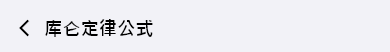
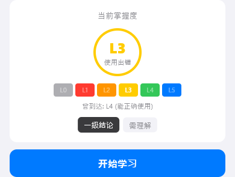
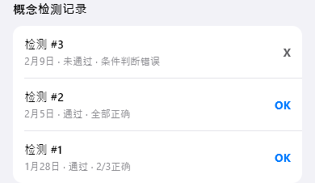
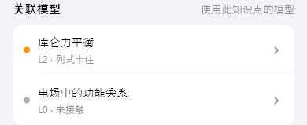

# knowledge-detail（知识点详情）

## 当前状态

第二阶段完成，所有组件已实现，视觉效果已对齐 HTML 原型。

## 路由标识

`/knowledge-detail`

## 组件树

```
KnowledgeDetailPage (Scaffold)
├── TopFrameWidget — 页面标题 + 返回
├── MasteryDashboardWidget — 掌握度仪表盘
├── ConceptTestRecordsWidget — 概念检测记录
└── RelatedModelsWidget — 关联模型列表
```

## 页面截图


---

## 组件详情

### top-frame



- 功能说明: 返回按钮 + 标题（知识点名称）
- 预期用途: 导航返回 + 显示当前知识点名称，无独立数据接入需求
- 对应 dart 文件: `lib/features/knowledge_detail/widgets/top_frame_widget.dart`
- 视觉状态: 已对齐 HTML 原型

### mastery-dashboard



- 功能说明: 展示知识点掌握度等级和进度
- 预期用途: 接入知识点掌握度 API，展示当前等级（L0-L5）、进度条、掌握度描述。底部提供「开始学习」按钮跳转知识点学习页。当前为 mock 数据
- 对应 dart 文件: `lib/features/knowledge_detail/widgets/mastery_dashboard_widget.dart`
- 视觉状态: 已对齐 HTML 原型

### concept-test-records



- 功能说明: 按时间倒序展示概念检测历史记录
- 预期用途: 接入知识点概念检测的历史记录数据，按时间倒序展示每次检测的通过/未通过状态及错误原因。帮助用户追踪单个知识点的掌握变化趋势，判断是否需要重新进入学习流程。当前为 mock 数据
- 对应 dart 文件: `lib/features/knowledge_detail/widgets/concept_test_records_widget.dart`
- 视觉状态: 已对齐 HTML 原型

### related-models



- 功能说明: 展示与该知识点关联的解题模型
- 预期用途: 接入知识点-模型关联 API，展示依赖该知识点的模型列表，每项显示模型名称、等级、颜色编码。点击可跳转模型详情页。当前为 mock 数据
- 对应 dart 文件: `lib/features/knowledge_detail/widgets/related_models_widget.dart`
- 视觉状态: 已对齐 HTML 原型

## 页面跳转

- 返回按钮 → 返回上一页
- 开始学习 → `/knowledge-learning`
- 关联模型点击 → `/model-detail`
