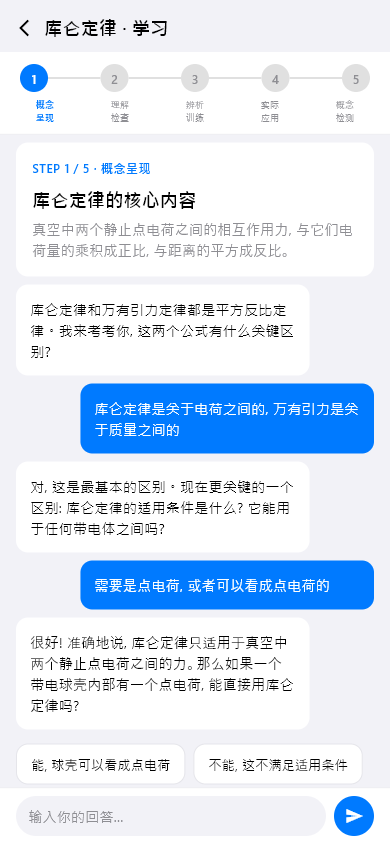
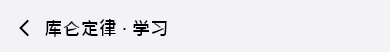
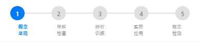
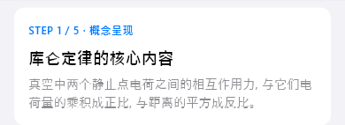
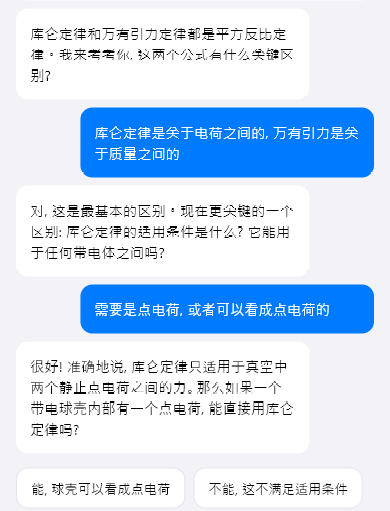
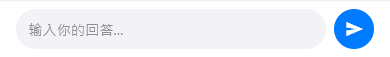

# knowledge-learning（知识点学习）

## 当前状态

第二阶段完成，所有组件已实现，视觉效果已对齐 HTML 原型。

## 路由标识

`/knowledge-learning`

## 组件树

```
KnowledgeLearningPage (Scaffold)
├── TopFrameWidget — 页面标题 + 返回
├── StepStageNavWidget — 步骤导航（Step 1-5）
├── [Step 内容，按当前步骤切换]
│   ├── Step1ConceptPresentWidget — 概念呈现
│   ├── Step2UnderstandingCheckWidget — 理解检查
│   ├── Step3DiscriminationTrainingWidget — 辨别训练
│   ├── Step4PracticalApplicationWidget — 实际应用
│   └── Step5ConceptTestWidget — 概念测试
├── LearningDialogueWidget — 学习对话区域
└── ActionOverlayWidget — 底部操作浮层
```

## 页面截图



---

## 组件详情

### top-frame



- 功能说明: 返回按钮 + 标题（知识点名称 + 学习）
- 预期用途: 导航返回 + 显示当前学习的知识点名称
- 对应 dart 文件: `lib/features/knowledge_learning/widgets/top_frame_widget.dart`
- 视觉状态: 已对齐 HTML 原型

### step-stage-nav



- 功能说明: 5 步学习流程的步骤导航条
- 预期用途: 展示学习进度（Step 1-5），当前步骤高亮，已完成步骤打勾。点击可切换步骤
- 对应 dart 文件: `lib/features/knowledge_learning/widgets/step_stage_nav_widget.dart`
- 视觉状态: 已对齐 HTML 原型

### step1-concept-present



- 功能说明: 第一步「概念呈现」的内容区域
- 预期用途: 接入知识点学习 API，展示概念的定义、公式、图示等核心内容。当前为 mock 数据
- 对应 dart 文件: `lib/features/knowledge_learning/widgets/step1_concept_present_widget.dart`
- 视觉状态: 已对齐 HTML 原型
- 截图说明: 默认显示 Step 1，Step 2-5 需切换步骤后才可见

### learning-dialogue



- 功能说明: 学习过程中的 AI 对话区域
- 预期用途: 接入 AI 对话 API，以对话形式引导学习。AI 讲解→提问→用户回答→AI 反馈。当前为 mock 对话数据
- 对应 dart 文件: `lib/features/knowledge_learning/widgets/learning_dialogue_widget.dart`
- 视觉状态: 已对齐 HTML 原型

### action-overlay



- 功能说明: 底部操作浮层（提交、下一步等）
- 预期用途: 提供学习流程中的操作按钮，控制学习流程推进
- 对应 dart 文件: `lib/features/knowledge_learning/widgets/action_overlay_widget.dart`
- 视觉状态: 已对齐 HTML 原型

## 页面跳转

- 返回按钮 → 返回上一页（/knowledge-detail）
