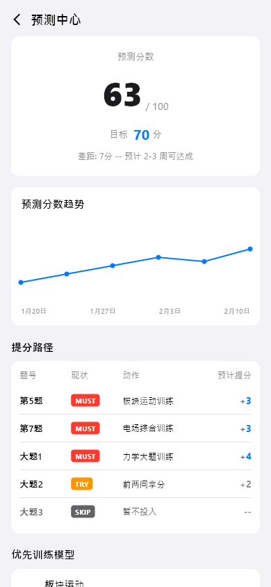
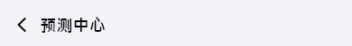
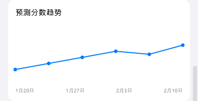
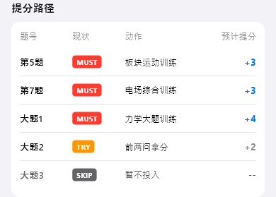

# prediction-center（预测中心）

## 当前状态

第二阶段完成，所有组件已实现，视觉效果已对齐 HTML 原型。

## 路由标识

`/prediction-center`

## 组件树

```
PredictionCenterPage (Scaffold)
├── TopFrameWidget — 页面标题 + 返回
├── ScoreCardWidget — 预测分数卡片
├── TrendCardWidget — 预测分数趋势图
├── ScorePathTableWidget — 提分路径表
└── PriorityModelListWidget — 优先训练模型排名
```

## 页面截图



---

## 组件详情

### top-frame



- 功能说明: 返回按钮 + 标题「预测中心」
- 预期用途: 导航返回 + 页面标题展示，无数据接入需求
- 对应 dart 文件: `lib/features/prediction_center/widgets/top_frame_widget.dart`
- 视觉状态: 已对齐 HTML 原型

### score-card


- 功能说明: 居中展示预测分数（63/100）和目标分（70）
- 预期用途: 接入预测分数 API，展示当前 AI 预测分数、满分、目标分、差距。作为预测中心的核心信息入口。当前为 mock 数据（63/100，目标70）
- 对应 dart 文件: `lib/features/prediction_center/widgets/score_card_widget.dart`
- 视觉状态: 已对齐 HTML 原型

### trend-card



- 功能说明: 以折线图展示预测分数的历史趋势
- 预期用途: 接入预测分数历史 API，以折线图展示近期预测分数变化趋势（如 55→57→59→61→60→63），横轴为日期，纵轴为分数。帮助用户直观看到进步轨迹。当前为 mock 数据
- 对应 dart 文件: `lib/features/prediction_center/widgets/trend_card_widget.dart`
- 视觉状态: 已对齐 HTML 原型

### score-path-table



- 功能说明: 以表格展示 AI 提分路径规划
- 预期用途: 接入 AI 提分路径规划 API，以表格展示每道题的「现状态度(MUST/TRY/SKIP)」「建议动作」「预计提分」。用户据此了解投入产出比最高的提分路径，点击题号可跳转至对应题目的聚合分析页。当前为 mock 数据
- 对应 dart 文件: `lib/features/prediction_center/widgets/score_path_table_widget.dart`
- 视觉状态: 已对齐 HTML 原型

### priority-model-list


- 功能说明: 按优先级排名展示推荐训练的模型
- 预期用途: 接入 AI 优先训练推荐 API，按提分效率排名展示推荐模型（如 1.板块运动 +5分, 2.库仑力平衡 +3分）。点击可跳转模型详情页开始训练。当前为 mock 数据
- 对应 dart 文件: `lib/features/prediction_center/widgets/priority_model_list_widget.dart`
- 视觉状态: 已对齐 HTML 原型

## 页面跳转

- 返回按钮 → 返回上一页
- 提分路径表题号 → `/question-aggregate`
- 优先模型点击 → `/model-detail`
