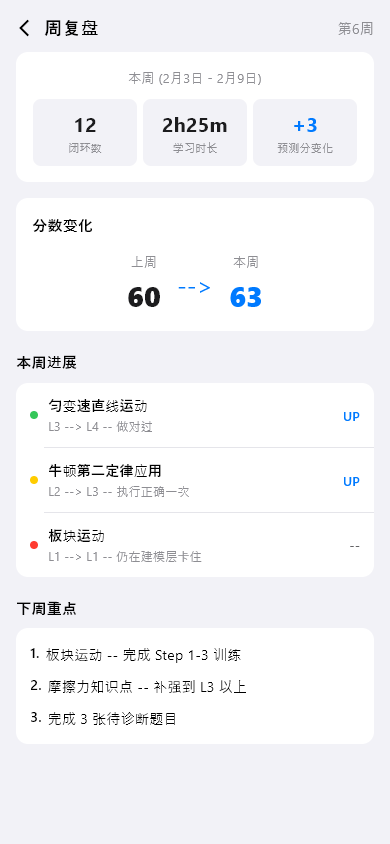
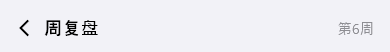
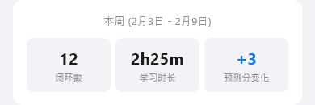
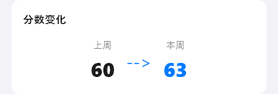
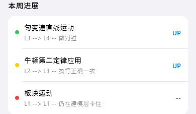
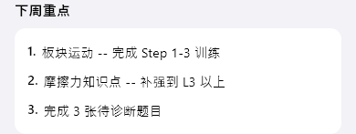

# weekly-review（周复盘）

## 当前状态

第二阶段完成，所有组件已实现，视觉效果已对齐 HTML 原型。

## 路由标识

`/weekly-review`

## 组件树

```
WeeklyReviewPage (Scaffold)
├── TopFrameWidget — 页面标题 + 返回
├── WeeklyDashboardWidget — 本周统计仪表盘
├── ScoreChangeWidget — 分数变化对比
├── WeeklyProgressWidget — 本周训练进度
└── NextWeekFocusWidget — 下周重点
```

## 页面截图



---

## 组件详情

### top-frame



- 功能说明: 返回按钮 + 标题「周复盘 · 第6周」
- 预期用途: 导航返回 + 显示当前周次，无独立数据接入需求
- 对应 dart 文件: `lib/features/weekly_review/widgets/top_frame_widget.dart`
- 视觉状态: 已对齐 HTML 原型

### weekly-dashboard



- 功能说明: 展示本周三个核心统计（闭环数、学习时长、预测分变化）
- 预期用途: 接入周维度统计 API，展示本周闭环数、总学习时长、预测分变化值。当前为 mock 数据（闭环12, 2h25m, +3）
- 对应 dart 文件: `lib/features/weekly_review/widgets/weekly_dashboard_widget.dart`
- 视觉状态: 已对齐 HTML 原型

### score-change



- 功能说明: 居中展示上周→本周的分数变化对比
- 预期用途: 接入周预测分数 API，展示上周分数和本周分数的对比（如 60→63），直观展示进步幅度。当前为 mock 数据
- 对应 dart 文件: `lib/features/weekly_review/widgets/score_change_widget.dart`
- 视觉状态: 已对齐 HTML 原型

### weekly-progress



- 功能说明: 展示本周各训练项的等级变动
- 预期用途: 接入周维度的模型/知识点等级变化数据，以列表展示本周每个训练项的等级变动(L2→L3)和状态(UP/持平)。让用户直观看到一周的训练成果，持平项提示需要调整策略。当前为 mock 数据
- 对应 dart 文件: `lib/features/weekly_review/widgets/weekly_progress_widget.dart`
- 视觉状态: 已对齐 HTML 原型

### next-week-focus



- 功能说明: 展示下周重点训练建议
- 预期用途: 接入 AI 周规划 API，以编号列表展示下周建议重点（如 1.板块运动 Step 1-3, 2.摩擦力 L3以上, 3.完成3张待诊断）。当前为 mock 数据
- 对应 dart 文件: `lib/features/weekly_review/widgets/next_week_focus_widget.dart`
- 视觉状态: 已对齐 HTML 原型

## 页面跳转

- 返回按钮 → 返回上一页
