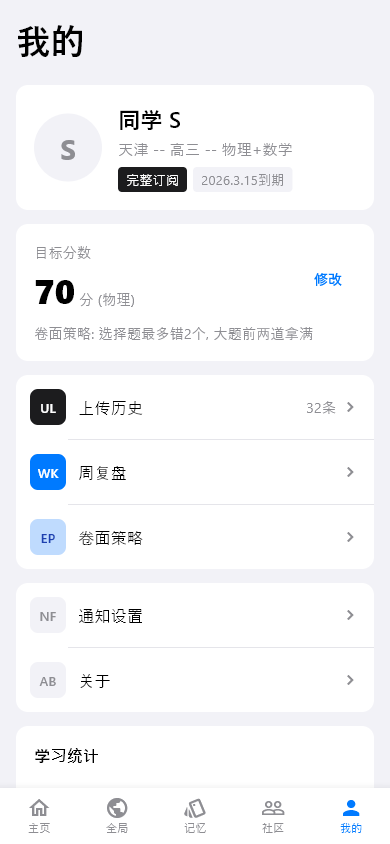
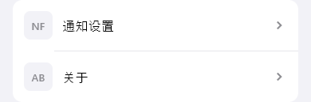
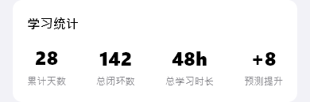

# profile（我的）

## 当前状态

第二阶段完成，所有组件已实现，视觉效果已对齐 HTML 原型。

## 路由标识

`/profile`

## 组件树

```
ProfilePage (PageShell, tabIndex: 4)
├── TopFrameWidget — 页面标题
├── UserInfoCardWidget — 用户信息卡片
├── TargetScoreCardWidget — 目标分数卡片
├── ThreeRowNavigationWidget — 三行导航（上传历史/周复盘/卷面策略）
├── TwoRowNavigationWidget — 两行导航（通知设置/关于）
└── LearningStatsWidget — 学习统计
```

## 页面截图



---

## 组件详情

### top-frame


- 功能说明: 页面标题「我的」
- 预期用途: 导航标题展示，无数据接入需求
- 对应 dart 文件: `lib/features/profile/widgets/top_frame_widget.dart`
- 视觉状态: 已对齐 HTML 原型

### user-info-card


- 功能说明: 展示用户头像、昵称、标签
- 预期用途: 接入用户信息 API，展示头像、昵称「同学 S」、年级标签、学科标签。当前为 mock 数据
- 对应 dart 文件: `lib/features/profile/widgets/user_info_card_widget.dart`
- 视觉状态: 已对齐 HTML 原型

### target-score-card


- 功能说明: 展示目标分数和当前进度
- 预期用途: 接入用户目标设置 API，展示目标分数（70）和当前预测分的差距。可点击修改目标分。当前为 mock 数据
- 对应 dart 文件: `lib/features/profile/widgets/target_score_card_widget.dart`
- 视觉状态: 已对齐 HTML 原型

### three-row-navigation


- 功能说明: 三行导航入口（上传历史/周复盘/卷面策略）
- 预期用途: 提供三个功能入口的快捷导航。上传历史显示「32条」trailing 文本。点击分别跳转对应页面
- 对应 dart 文件: `lib/features/profile/widgets/three_row_navigation_widget.dart`
- 视觉状态: 已对齐 HTML 原型

### two-row-navigation



- 功能说明: 两行导航入口（通知设置/关于）
- 预期用途: 提供设置类功能入口。后续接入通知设置页和关于页
- 对应 dart 文件: `lib/features/profile/widgets/two_row_navigation_widget.dart`
- 视觉状态: 已对齐 HTML 原型

### learning-stats



- 功能说明: 展示四个学习统计指标
- 预期用途: 接入用户学习统计 API，展示「累计天数28」「总闭环数142」「总学习时长48h」「预测提升+8」。当前为 mock 数据
- 对应 dart 文件: `lib/features/profile/widgets/learning_stats_widget.dart`
- 视觉状态: 已对齐 HTML 原型

## 页面跳转

- 上传历史 → `/upload-history`
- 周复盘 → `/weekly-review`
- 卷面策略 → `/register-strategy`
