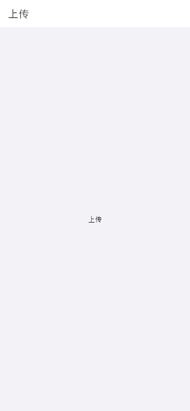

# upload-menu（上传菜单）

## 当前状态

占位页面，尚未实现完整组件。当前为简单 Scaffold + 居中文本。

## 路由标识

`/upload-menu`

## 组件树

```
UploadMenuPage (Scaffold)
└── Center(Text('上传'))
```

## 页面截图



---

## 组件详情

本页面当前为占位实现，widget 文件存在但未被页面引用：

### top-frame（未使用）

- 功能说明: 返回按钮 + 标题「上传」
- 预期用途: 导航返回 + 页面标题展示
- 对应 dart 文件: `lib/features/upload_menu/widgets/top_frame_widget.dart`
- 视觉状态: 占位 Placeholder，待实现

### main-content（未使用）

- 功能说明: 上传方式选择主体内容
- 预期用途: 接入上传服务，展示多种上传方式入口（拍照上传/相册选择/极简录入）。用户选择上传方式后进入对应的上传流程。当前为 Placeholder，待实现
- 对应 dart 文件: `lib/features/upload_menu/widgets/main_content_widget.dart`
- 视觉状态: 占位 Placeholder，待实现

## 页面跳转

- 返回按钮 → 返回上一页（/）
